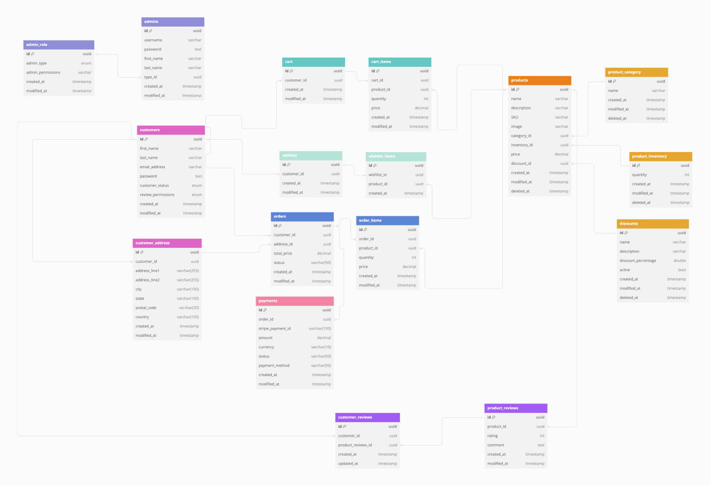

# Chic Haven Store

Chic Haven Boutique is a full-stack e-commerce web application built with the PERN stack (PostgreSQL, Express, React, Node.js). The project scope included project planning, system design, UI/UX design, and development. The application consists of a robust backend that is consumed by a storefront for customers and an admin portal for managing products, users, and orders. The storefront integrates Stripe for payment processing, and the layout is designed with Styled Components. The admin portal is built using Material UI for an enhanced user experience.

## Table of Contents

- [Features](#features)
- [Technologies Used](#technologies-used)
- [Project Planning & Management](#project-planning)
- [Database Structure & Schema](#database-structure)
- [Design Process](#design-process)
- [Installation](#installation)
- [Usage](#usage)
- [API Endpoints](#api-endpoints)
- [Deployment](#deployment)

- [Live Demo](#demo)
- [Contact](#contact)

## Features

### Customer Features

### Admin Features

## Technologies Used

- **Frontend**:
- **Backend**:
- **Database**:
- **Authentication**:
- **Payment Processing**:
- **Design Tooks**:
- **Project Planning & Management**:
- **Database Planning**:

## Project Planning & Management

## Database Structure & Schema

## Design Process

## Installation

## Usage

## API Endpoints

## Deployment

### YAML
