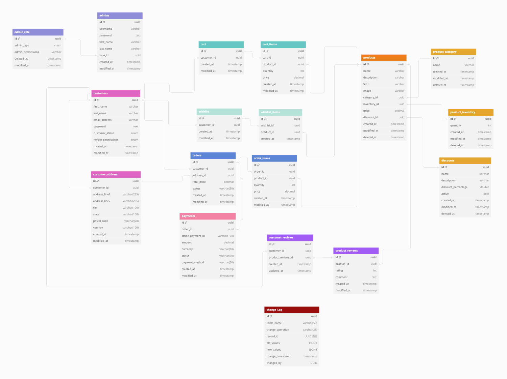
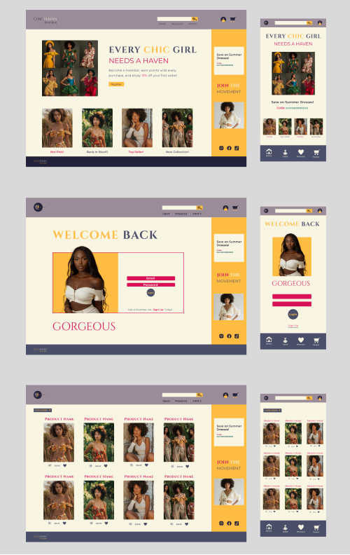
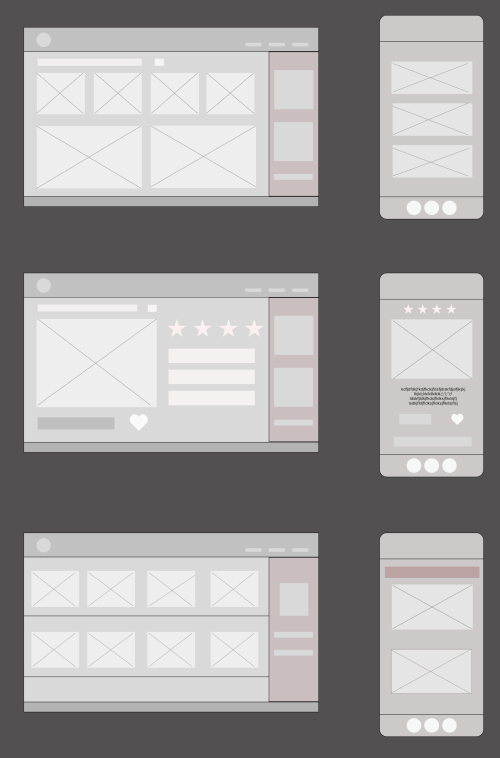
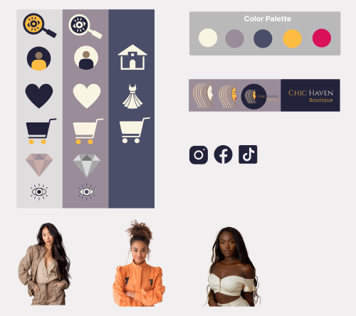

# Chic Haven Store

Chic Haven Boutique is a full-stack e-commerce web application built with PostgreSQL, Express, React, Node.js. The project scope included project planning/management, system design, UI/UX design, and development. The application backend that uses a REST API to serve a store front and admin portal. My personal goals for the project was to challenge myself and grow as a developer and novice designer by creating an application that was beautiful, functional, and well built, showcasing my ability to own a project from conceptualization to deployment.

Key Features:

- Store-front.
- Admin Portal
- Payment Processing.
- Token Based Authentication.
- Role Based Authorization.
- Access validation.
- Record Change Tracking.
- File upload.

## Table of Contents

- [Features](#features)
- [Technologies Used](#technologies-used)
- [Project Planning & Management](#project-planning--management)
- [Database Structure & Schema](#database-structure--Schema)
- [Design Process](#design-process)
- [Installation](#installation)
- [Usage](#usage)
- [API Endpoints](#api-endpoints)
- [Deployment](#deployment)
- [Live Demo](#live-demo)
- [Contact](#contact)

## Features

### Customer Features

### Admin Features

## Technologies Used

- **Frontend**: React, Styled Components, Material UI.
- **Backend**: Node.js, Express.js, Multer, YAML, Cors.
- **Database**: PSQL.
- **Authentication**: JWT Tokens, Bcrypt.
- **Payment Processing**: Stripe.
- **Design Tools**: Figma, Canva, Adobe Illustrator, Coolors, Photoshop, Midjourney.
- **Project Planning & Management**: Git, Trello.
- **Database Planning**: dbdiagram.io.

## Project Planning & Management

## Database Structure & Schema

The database structure and schema was designed based on app requirements and user stories. The schema was created with dbdiagram.io.

#### 👉🏽 Check Out My Dbdiagram File 🔗 [here](https://dbdiagram.io/d/Chic-Haven-Database-669ffe328b4bb5230e262715)

## Design Process

The project UI/UX design goal was to create a beautiful, intuitive application that had creative flare and kept accessability in mind. The design process entailed reviewing user stories to identify core app functionality, creating wire-frames (lo-fi, mid-fi, hi-fi).

- Color Palette: Developed with Coolors.
- Custom icons: Created using Canva, Adobe Illustrator, and Figma.
- Product & App photos Images: Created with Midjourney with AI prompting.

#### 👉🏽 Check Out My Figma File 🔗 [here](https://www.figma.com/design/Jx7WIUytXCqJiObwlrSZNk/Chic-Haven?node-id=0-1&t=fiJwmHDIfXfUwXGV-1)

# Hi-Fi

# Mid-Fi

# Custom Assets

## Installation

## Usage

## API Endpoints

## Deployment

### YAML

## Live Demo
