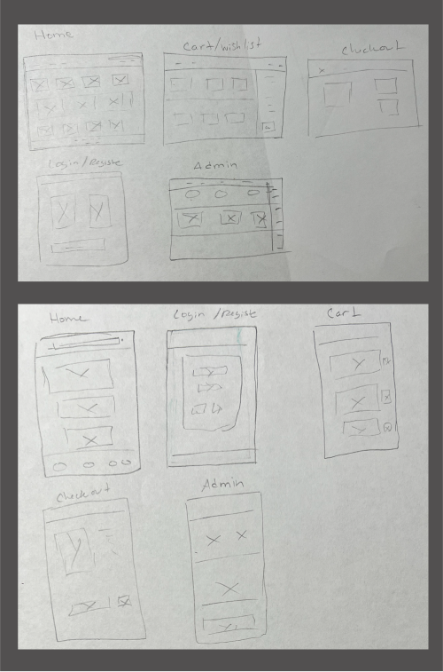

# Chic Haven Store

Chic Haven Boutique is a full-stack e-commerce web application built with the PERN stack (PostgreSQL, Express, React, Node.js). The project scope included project planning, system design, UI/UX design, and development. The application consits of a robust backend that is consumed by a store front and admin portal. My personal goals for the project was to challenge myself and grow as a developer and novice designer by creating an appication that was beautiful, functional, and well built, showcasing my ability to own a project from conceptualization to deployment.

New Skills Aquired:

- Stripe
- Material UI
- YAML
- Cors
- Multer

## Table of Contents

- [Features](#features)
- [Technologies Used](#technologies-used)
- [Project Planning & Management](#project-planning--management)
- [Database Structure & Schema](#database-structure--Schema)
- [Design Process](#design-process)
- [Installation](#installation)
- [Usage](#usage)
- [API Endpoints](#api-endpoints)
- [Deployment](#deployment)
- [Live Demo](#live-demo)
- [Contact](#contact)

## Features

### Customer Features

### Admin Features

## Technologies Used

- **Frontend**:
- **Backend**:
- **Database**:
- **Authentication**:
- **Payment Processing**:
- **Design Tooks**:
- **Project Planning & Management**:
- **Database Planning**:

## Project Planning & Management

## Database Structure & Schema

The database structure and schema was designed based on app requirements and user stories. The schema was created with dbdiagram.io.

#### 👉🏽 Check Out My Dbdiagram File 🔗 [here](https://dbdiagram.io/d/Chic-Haven-Database-669ffe328b4bb5230e262715)

## Design Process

The project UI/UX design goal was to create a beautiful, inuitive application that had creative flare and kept accessability in mind. The design process entailed reviewing user stories to identify core app functionality, creating wire-frames (lo-fi, mid-fi, hi-fi).

- Color Palette: Developed with Coolors.
- Custome icons: Created using Canva, Adobe Illustrator, and Figma.
- Product & App photos Images: Created with Midjourney with AI prompting.

#### 👉🏽 Check Out My Figma File 🔗 [here](https://www.figma.com/design/Jx7WIUytXCqJiObwlrSZNk/Chic-Haven?node-id=0-1&t=fiJwmHDIfXfUwXGV-1)

# Hi-Fi

# Custom Assets

# Mid-Fi

# Mid-Fi

## Installation

## Usage

## API Endpoints

## Deployment

### YAML

## Live Demo
